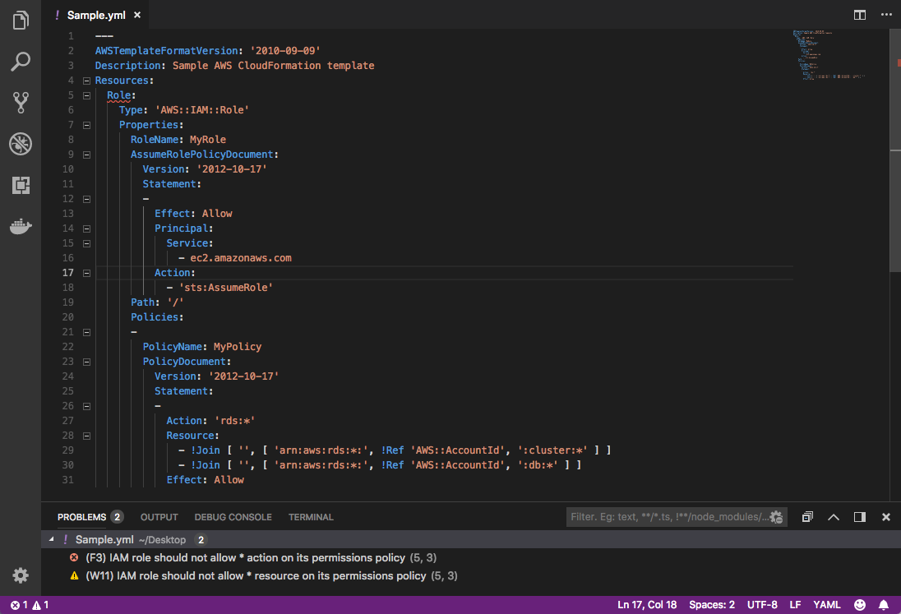

# Cfn-Nag Linter

VS Code CloudFormation Linter uses  [cfn-nag](https://github.com/stelligent/cfn_nag) to lint your CloudFormation templates.

## Features

Uses [cfn-nag](https://github.com/stelligent/cfn_nag) to parse and show issues with CloudFormation templates.

For example, if you define a Resource named *Role* and specify a resource with an asterisk or an action with an asterisk, errors and warnings are reported:

## Requirements

Requires [cfn-nag](https://github.com/stelligent/cfn_nag) to be installed: `gem install cfn-nag`

## Extension Settings

* `cfnNagLint.path`: (Optional) path to cfn_nag script
* `cfnNagLint.ruleDirectory`: (Optional) path to extra rule directory
* `cfnNagLint.profilePath`: (Optional) Path to a profile file
* `cfnNagLint.parameterValuesPath`: (Optional) Path to a JSON file to pull Parameter values from